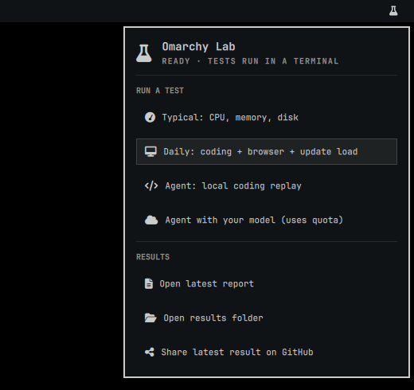

<div align="center">

<picture>
  <source media="(prefers-color-scheme: dark)" srcset="assets/omarchy-logo-dark.svg">
  
</picture>

# Omarchy Lab

**面向 Linux / Omarchy 的三模式性能测试：硬件、AI Agent 编程、日常多任务**

Omarchy 顶栏插件或单文件 `.pyz` · 仅依赖 Python 标准库 · 普通用户运行


[English](README.md) · **简体中文** · [繁體中文](README.zh-TW.md) · [日本語](README.ja.md)

</div>

---

## 三种模式

| 模式 | 测试内容 | 主要结果 |
| --- | --- | --- |
| 🧪 **典型测试** `typical` | CPU、内存、磁盘、小文件同步写入、持续负载 | 吞吐量、延迟、温度 |
| 🤖 **Agent 编程** `agent` | 固定工程中的修 bug、加功能、补测试；默认使用 Pi | 独立验收通过率、总耗时、工具耗时、模型事件 |
| 🖥️ **日常测试** `daily` | 单独编程 → 8 个网页＋编程 → 网页＋编程＋模拟更新负载 | 编程变慢倍数、网页响应指标、CPU／内存／磁盘等待 |

## 快速开始

### 1. 下载

```sh
curl -L -o ~/Downloads/omarchy-lab.pyz \
  https://github.com/Charlie0113-T/omarchy_labs/releases/latest/download/omarchy-lab.pyz
```

`.pyz` 可直接运行，不必解压；它也是标准 ZIP，可以用 `unzip -l omarchy-lab.pyz` 查看全部源码。

### 2. 按需要选一行运行

```sh
python3 ~/Downloads/omarchy-lab.pyz typical       # 典型测试
python3 ~/Downloads/omarchy-lab.pyz agent --live  # Agent 编程（会调用模型）
python3 ~/Downloads/omarchy-lab.pyz daily         # 日常测试
```

完整参数见 `python3 ~/Downloads/omarchy-lab.pyz --help`。

## 🧩 Omarchy 插件

在 Omarchy（Quattro）上，Omarchy Lab 也可以放进顶栏。点击烧瓶图标即可启动测试、打开最新报告或结果文件夹、分享最新结果，或停止正在运行的测试。

<p align="center"></p>

### 安装

```sh
omarchy plugin add https://github.com/Charlie0113-T/omarchy_labs
omarchy plugin enable io.github.charlie0113-t.omarchy-lab
```

也可以使用 **Setup › Plugins › Add**。插件安装后默认处于停用状态，方便你先阅读代码；`enable` 会把图标放到顶栏右侧。

### 使用

- 每项测试都只在你选择后启动，并在可见的终端窗口中运行。关闭该窗口或选择“停止正在运行的测试”都会干净地停止：测试浏览器会关闭，临时文件会删除，并保存部分报告。
- “Agent + 你的模型”在调用模型前会要求你按回车确认。
- 面板跟随系统语言；测试本身会在终端里询问使用哪种语言。

### 更新与移除

```sh
omarchy plugin update io.github.charlie0113-t.omarchy-lab
omarchy plugin remove io.github.charlie0113-t.omarchy-lab
```

移除会先停用插件，再删除其文件夹 `~/.config/omarchy/plugins/io.github.charlie0113-t.omarchy-lab`。`~/omarchy-lab/` 中的测试结果会保留，不再需要时可自行删除。

### 插件会改动什么

- 安装到 `~/.config/omarchy/plugins/io.github.charlie0113-t.omarchy-lab/`。
- 启用时通过 Omarchy 自带的 `plugin enable`，在 `~/.config/omarchy/shell.json` 的顶栏布局中加入一项；停用或移除时会删掉这一项。
- 测试结果保存在 `~/omarchy-lab/`，运行时在家目录使用临时文件夹，结束后删除。安装、启用或登录时都不会运行任何东西，插件本身也从不使用 `sudo`。

### 依赖

| 用途 | 需要 |
| --- | --- |
| 全部功能 | 带 Quattro shell 的 Omarchy、Python 3.9+（Omarchy 已自带） |
| 典型测试 | `fio`、`sysbench` |
| 日常测试 | Chromium 或 Chrome |
| Agent + 你的模型 | 已配置好的 [Pi](https://github.com/earendil-works/pi) |
| 分享按钮 | `wl-copy`、`xdg-open`、`notify-send`（Omarchy 已自带） |

## 前置条件

- Python 3.9 或更新版本
- 典型测试：已安装 `fio`、`sysbench`（Omarchy 上：`sudo pacman -S --needed fio sysbench`）
- 真实 Agent：已配置好的 [Pi](https://github.com/earendil-works/pi)
- 日常模式：桌面 Chromium／Chrome

> [!IMPORTANT]
> 用普通用户运行，**不要给整条命令加 `sudo`**。

## 🌐 语言

提示、`--help`、错误信息和报告支持 English、简体中文、繁體中文、日本語。

- 在终端里运行且没有加 `--lang` 时，开始前会问一次；直接按回车即沿用系统语言。
- `--lang en`、`zh-CN`、`zh-TW` 或 `ja` 直接指定语言，不再询问；`--lang auto` 跟随系统区域设置。
- 设置环境变量 `OMARCHY_LAB_LANG=zh-CN`，之后每次运行都使用该语言。

```sh
python3 ~/Downloads/omarchy-lab.pyz daily --lang zh-CN
```

各语言的测试负载完全相同：Agent 的任务提示和浏览器测试页正文不随语言变化，JSON 键名和状态码保持英文，因此不同语言跑出的结果可以直接比较。

## 📮 分享结果

每次测试结束后，工具会在报告目录里保存 `issue.md`：按本项目固定格式（摘要、设备与存储、结果、提示、反馈）排好的 GitHub Issue 正文，并用你选择的语言打印发布步骤。

- 报告以英文为准，方便所有人的结果统一对照；如果你用其他语言运行，后面会附上可展开的同一份报告的该语言版本。
- 不会自动上传任何内容。发布前请检查文件：其中包含硬件、内核和挂载信息，家目录会显示为 `~`。
- 用[测试报告 Issue 模板](https://github.com/Charlie0113-T/omarchy_labs/issues/new?template=test-report.md)发布，或者运行 `gh issue create -R Charlie0113-T/omarchy_labs --title "…" --body-file issue.md`。

## 🤖 Agent 模式

Agent 模式会先跑固定的本机工具链回放，再执行真实任务。

- 失败或超时不会被算成“速度快”，验收也不依赖 Agent 自称完成。
- 总耗时包含模型和网络等待，不能直接当成硬件成绩。
- 不加 `--live` 时只做本机固定回放，不调用模型。

> [!WARNING]
> 默认真实任务一轮、最多十分钟，**会使用你的模型额度**。

正式对照建议固定模型并跑三轮：

```sh
python3 ~/Downloads/omarchy-lab.pyz agent --live --model '你的完整模型ID' --rounds 3
```

## 🖥️ 日常模式

日常模式中的编程使用固定回放，不调用模型。更新负载默认模拟解压和磁盘同步。

若要观察**真实系统更新＋浏览器＋编程**：

```sh
python3 ~/Downloads/omarchy-lab.pyz daily --observe-update --seconds 600
```

看到提示后，在另一终端按 Omarchy 自带流程启动更新（参见 [Omarchy Manual](https://omarchy.org/manual/updates/)）。脚本负责观察，不代执行更新。

> [!TIP]
> 日常测试期间保持测试仪表盘可见，不要最小化。

## 📊 结果

结果自动打印，并保存在 `~/omarchy-lab/<时间戳>/`：

```text
~/omarchy-lab/<时间戳>/
├── report.txt     # 可读报告
├── report.en.txt  # 英文副本（用其他语言运行时生成）
├── issue.md       # 可直接发布的 GitHub Issue
├── results.json   # 结构化结果
└── samples.csv    # 逐秒采样
```

| 退出码 | 含义 |
| :---: | --- |
| `0` | 执行完整且任务通过 |
| `1` | 不完整或有任务失败 |
| `2` | 参数或前置条件错误 |

## 🛠️ 从源码构建

源码在 [`src/`](src/)，Omarchy 插件直接运行这份源码。打包发布用的 `dist/omarchy-lab.pyz` 并运行测试：

```sh
python3 scripts/build.py
python3 -m unittest discover -s tests
```

所有界面文字集中在 [`src/i18n.py`](src/i18n.py)，每条消息的四种语言并排存放；测试会检查每条消息在每种语言里都存在，且占位符一致。

## 许可证

本项目以 [Apache License 2.0](LICENSE) 发布。

Omarchy 标志来自 [omacom/omarchy](https://github.com/omacom/omarchy)（MIT 许可）。本项目是社区工具，与 Omarchy 官方无关。
